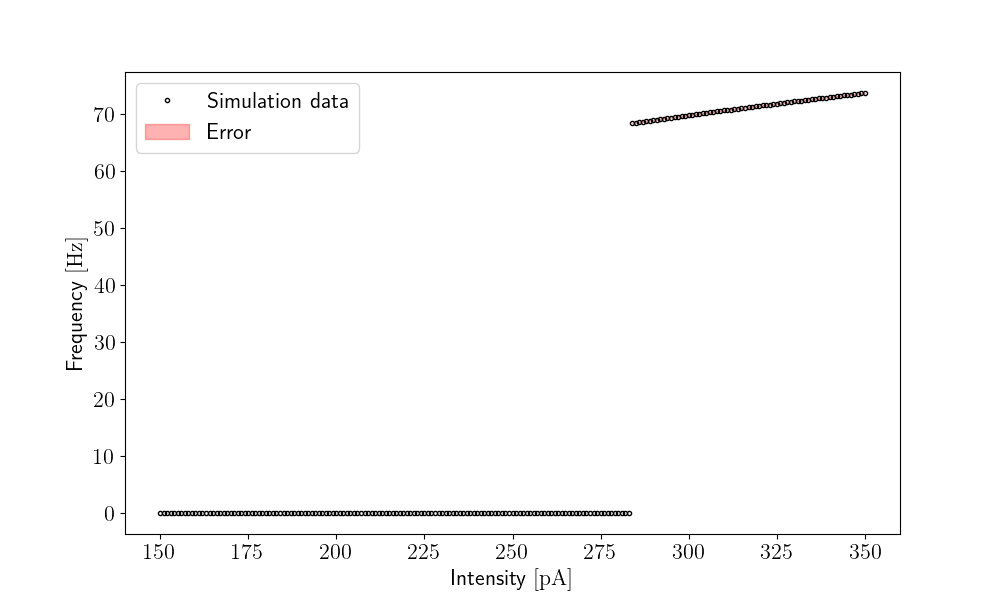

# Hodgkin-Huxley model
4 dimensional model for neuronal modelling in Julia

# The model

The Hodgkin–Huxley model, or conductance-based model, is a mathematical model that describes how action potentials in neurons are initiated and propagated. It is a set of nonlinear differential equations that approximates the electrical characteristics of excitable cells such as neurons and cardiac myocytes. 

The typical Hodgkin–Huxley model treats each component of an excitable cell as an electrical element. The lipid bilayer is represented as a capacitance (
), voltage-gated ion channels are represented by electrical conductances (, where n is the specific ion channel) that depend on both voltage and time. Leak channels are represented by linear conductances (
). The electrochemical gradients driving the flow of ions are represented by voltage sources (
) whose voltages are determined by the ratio of the intra and extracellular concentrations of the ionic species of interest. Finally, ion pumps are represented by current sources (
). The membrane potential is denoted by .

Mathematically, the current flowing through the lipid bilayer is written as

and the current through a given ion channel is the product

%5C%3B%7D)

where 
 is the reversal potential of the i-th ion channel. Thus, for a cell with sodium and potassium channels, the total current through the membrane is given by:

%2Bg_%7BNa%7D(V_%7Bm%7D-V_%7BNa%7D)%2Bg_%7Bl%7D(V_%7Bm%7D-V_%7Bl%7D)%7D)

where  is the total membrane current per unit area,  is the membrane capacitance per unit area,  and  are the potassium and sodium conductances per unit area, respectively,  and  are the potassium and sodium reversal potentials, respectively, and  and  are the leak conductance per unit area and leak reversal potential, respectively. The time dependent elements of this equation are , , and , where the last two conductances depend explicitly on voltage as well.

It turns out that the channels are not always opened but the probability to find them opened depend on the ion concentrations, so the voltage. By denoting  the probability that the Na channel is opened,  the probability that the K channel is opend and  the probability that this last channel is actually activated (more information about this can be found in the references) we can construct a set of 4 diferential equations to model a neuron.

%2B%5Cbar%7BG%7D_%7BK%7D%20n%5E%7B4%7D%5Cleft(E_%7BK%7D-V%5Cright)%20%2BG_%7Bm%7D%5Cleft(V_%7Br%20e%20s%20t%7D-V%5Cright)%2BI%20%5C%5C%5C%5C%20%20%5Cdisplaystyle%20%5Cfrac%7Bd%20x%7D%7Bd%20t%7D%3D%5Calpha_%7Bx%7D(V)(1-x)-%5Cbeta_%7Bx%7D(V)%20x%20%5Cend%7Barray%7D%5Cend%7Bequation*%7D)

with  and  are empirical equations, which can be found for instance in 1.

# Some results

The results shown below are obtained with an integration time step of , a total time of  and the initial values of the evolved magnitudes , . 

First results are shown for the evolution in time of the membrane potential for an intensity value of .

As we can see with this input current value the stimulus is not enough to excite the neuron.

Now we increase the intensity up to 

Now the neuron get excited for a short period of time but it relaxes finally to a steady state with any response.

Finally we increase the input current value to 

As we can see in the figure, for this values of the input current the neuron is effectively excited and there are several spikes. In fact, the neuron would remain spiking if the simulation was continued, as for this values of the input current the dynamical system follows a limit cycle.

So, as we increase the intensity the number of spikes increases too. In fact the frequency of spikes increases almost linearly after a certain threshold. With the program in this repository this can be computed too.

As we can see the pulsing intensity is  until a threshold is reached and a big jump is performed to . After that the frequency increases almost linearly. This kind of behaviour (this discontinuous jump, basically) is characteristic of a type II excitable system.
        
The statistical errors made in the measurements of the pulsating frequency is represented with a red shaded area. However, their values are so small that they can't be seen.

Now we can do the same calculation but starting from a high input current value:

By computing the spiking frequency starting from a high input current intensity value and decreasing it we observe that the threshold for the excitability of the neuron has shifted to . By plotting both results simultaneously we see that the neurons perform a kind of hysteresis loop.

# References
1. [Wikipedia](https://en.wikipedia.org/wiki/Hodgkin%E2%80%93Huxley_model)
2. [W. Gerstner lectures](https://icwww.epfl.ch/~gerstner/VideoLecturesGerstner.html)
